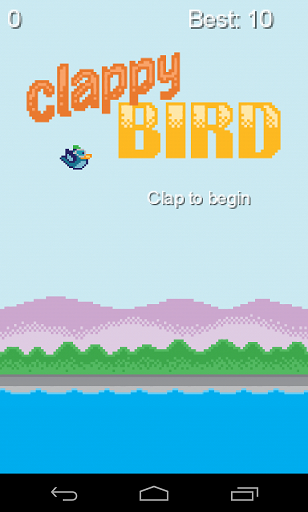
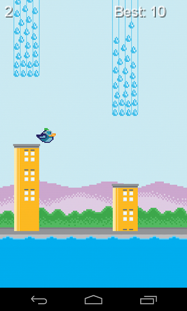
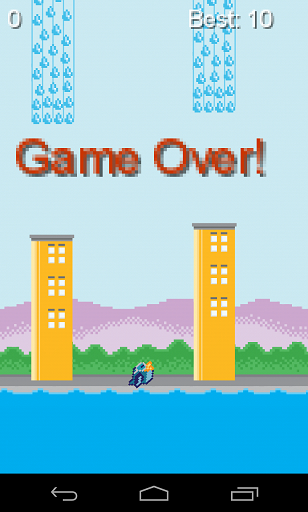

So I assume most of you know about Flappy Bird by now, legendary app, crazy drama, mad clones, etc. So earlier last week, on a Wednesday (or Thursday), one of my coworkers, Jiho, shared this idea: What if we make Flappy Bird, but we have to clap to get the bird to jump (aka *Clappy* Bird)?

Damn, that sounds cool. I decided to join him for the development, as a Mini Ludum Dare challenge. On Friday evening, we started the development. I proposed to use LibGDX because it provides pretty nice wrappers for just about everything you need to develop a game, and it has cross-platform support. Instead of making our own physics simulation, collision detection, etc., I picked Box2D as our base, and made the whole clone of Flappy Bird Prototype within the night. Was pretty fun!

The next day, our other coworker came in with some sound detection libs and we had a simple clapper going. Here is the Youtube Video for the working prototype with clapping (old prototype video was taken down by Jiho, but I have a demo of the working game):

<video width="406" height="720" controls>
  <source src="/clappy-bird.mp4" type="video/mp4">
  Your browser does not support the video tag.
</video>

This is pretty snazzy, isn't it? Here comes better. Today, we got some of the designer friends of Jiho to make some very very nice graphics for the game. After fighting with putting them on top of our prototype for hours (and my laptop just wouldn't run Eclipse properly, so I was trying to fix it for the whole afternoon before I gave up), the game finally feels complete! There are still just a little bit left to do, especially the clap detection part. I was hinting Jiho Saturday night at dinner that sounds were translated into frequency spectrum using Fast Fourier Transforms. He went off and did research for it and got a very fast implementation working, all we have left is to make it filter the correct frequencies in order to recognize a clap.

This has been really fun! I haven't been this excited about programming for a very long time, and this really brings me back and makes me want to play with it a lot more. Senior year of college, I made a game prototype with the exact same technology, and I haven't had motivation to finish it for such a long time. Now with Clappy Bird, I think I can finish my other design pretty soon.

Thanks everyone who participated the project, especially Jiho for making this happen!

Game Graphics:

