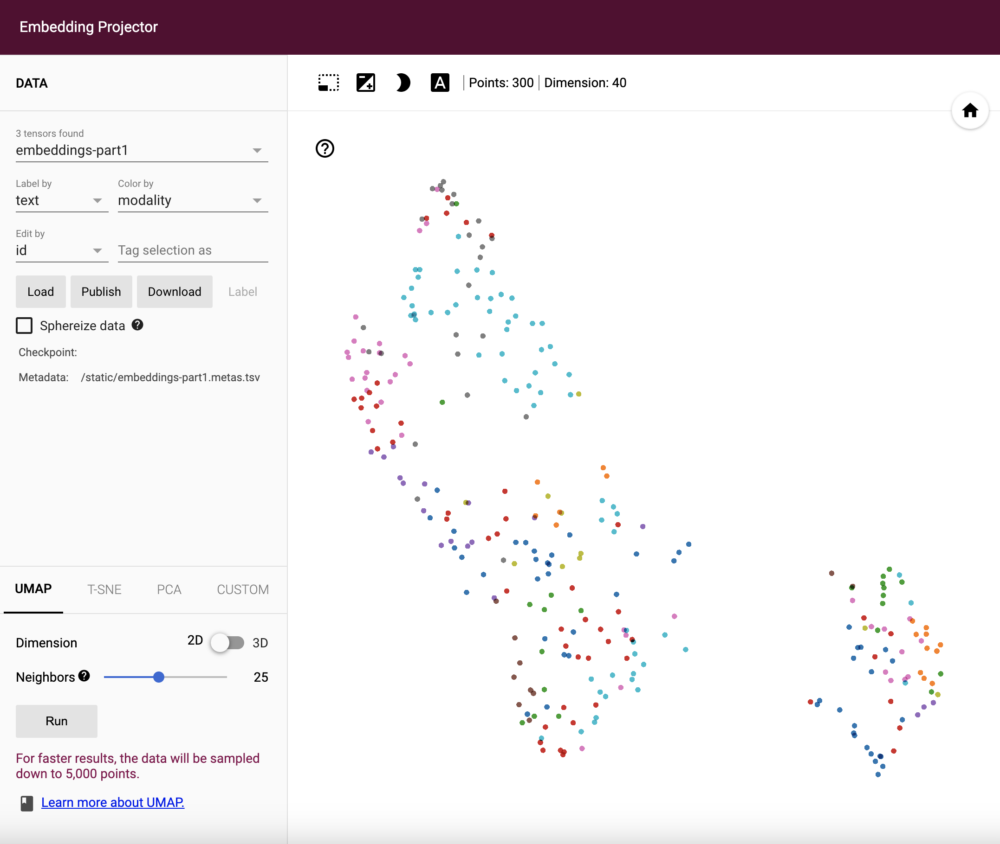
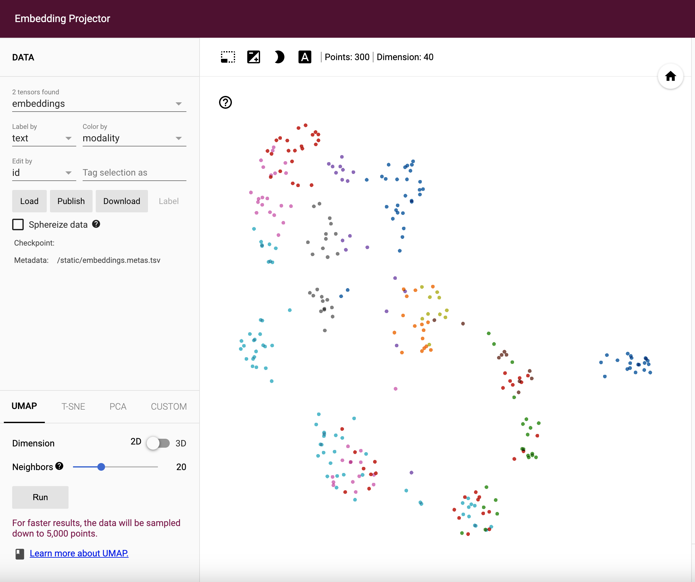

**Update 2024-12-27: Unfortunately, I did not continue this series because LLMs took over the world by storm. ChatGPT changed everything for me and my freelancing business. I lost motivation looking into the Rasa codebase.**

I am working on re-building Rasa’s DIET Classifier from the ground up using PyTorch. In Part 1 of the article, I built an intent classifier using pre-trained sentence features, which is essentially the “I” part of “DIET”. Before I get to the more interesting “T” part (”T” stands for “Transformers”), I realized that I missed an important detail, which is the loss calculations. As I re-watched the Rasa algorithm series for DIET and TED, I realized that both of these machine learning algorithms use an idea as backbone to calculate loss - Starspace.

[Starspace](https://arxiv.org/pdf/1709.03856.pdf) is an algorithm originally devised by Facebook for computing similarities across various types of embeddings, and what Rasa got out of this paper is mainly how the loss is computed. Instead of just calculating cross entropy loss between the correct input and label embedding similarities, it adds cross entropy loss between:

- positive input and negative label embedding similarities
- positive input and negative input embedding similarities
- positive label and negative label embedding similarities
- positive label and negative input embedding similarities

This combined loss function is designed to push/pull the embeddings so that similar ones are closer to each other and dissimilar ones are further apart.

Once this loss function is figured out, all I need to do is to implement it using PyTorch. Rasa’s implementation has a lot of branches when it builds the neural network and loss, since it has a lot of different configurations. Here I am implementing the main default branch for the loss - CrossEntropyLoss with all the positive / negative input / label embedding combinations, which is also described in the [DIET classifier paper](https://arxiv.org/pdf/2004.09936.pdf). Interestingly enough, while the margin ranking loss function used by Starspace is still in the DIET classifier source code, it is no longer the default for DIET.

I have updated the source code on GitHub so you guys can check it out. To demonstrate the difference, I am plotting the embeddings in 2D space between the old and new loss functions. Thankfully, Jina’s DocArray package has a handy `plot_embeddings` method in the DocumentArray class, which helps me visualize the embeddings very easily. The difference is quite big between these two loss functions.

Now with the properly implemented loss function, I can comfortably work on the transformer encoding layers in Part 3!