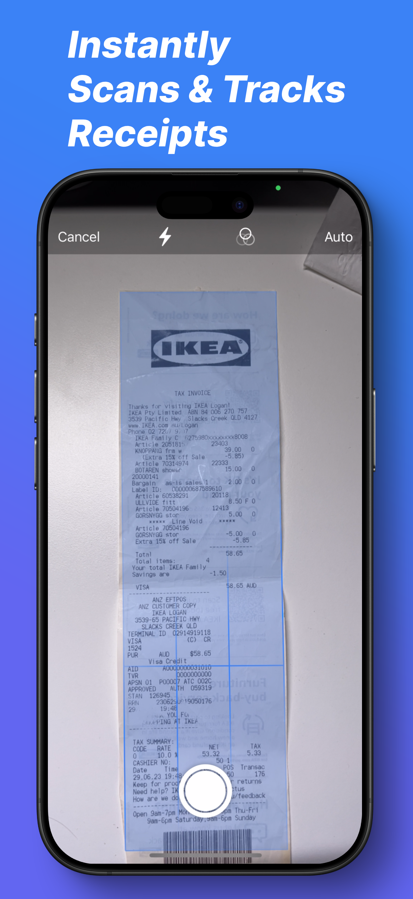
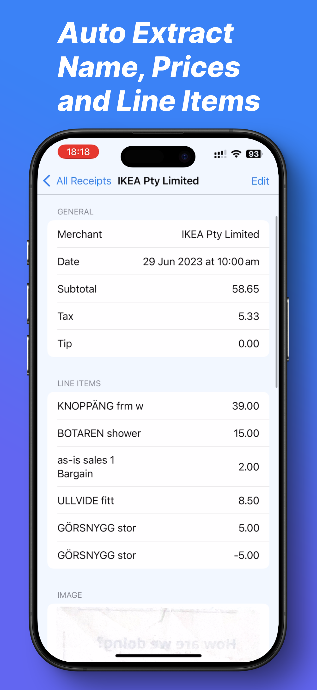
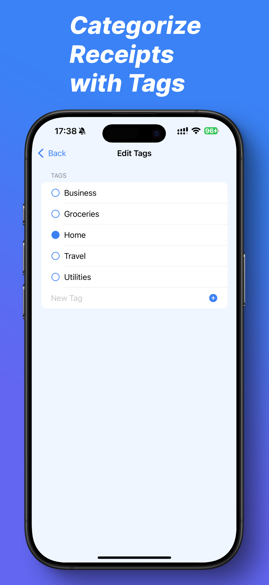
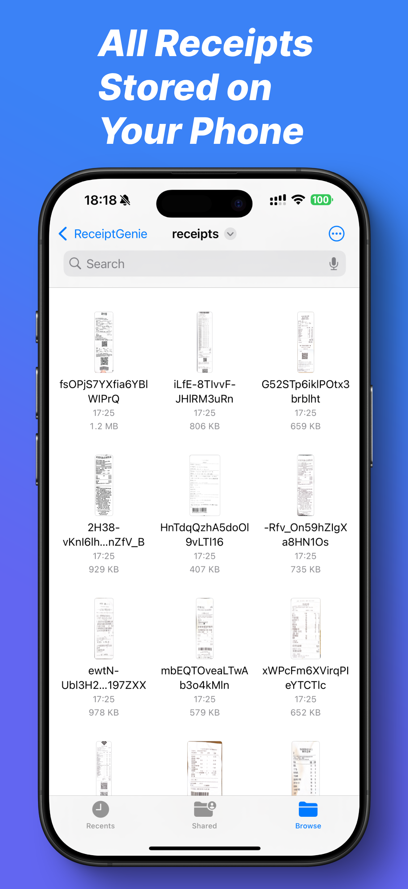

I have been a long-time digital nomad since before the pandemic, and when I travel, I often find it hard to keep track of my spending on a trip, not only because of the currency changes, but also that there are all sorts of payment methods that I have from different sources and even countries. The only way I have found to reliably funnel all of my expenses is via receipts. I can get a receipt from almost every country I go to. So I grew a habit to collect receipts and scanning them. After over a year I have more than one thousand receipts collected and still counting up. I used to build a webapp to scan these receipts but I wanted something more native on the phone so I can process them faster, so I built a dedicated [receipt scanning and tracking app on my iPhone](https://receipt-genie.com/?ref=blog).

It now may look a bit barebones but I have plans to refine it over time by adding reporting, exchange rates and AI tagging of receipts. I would love to be as privacy-aware as I possibly can in terms of using AI on this product, and what I can promise is that all the data is going to stay with you at all times and we do not sell any of the receipt data to third party.

If you have similar needs as I do, you can start using the app today by [getting it from the App Store](https://apps.apple.com/us/app/receipt-tracker-receiptgenie/id6740299816), and all the receipts scanned will be stored on-device. Happy to get feedback from the community too, thanks!

