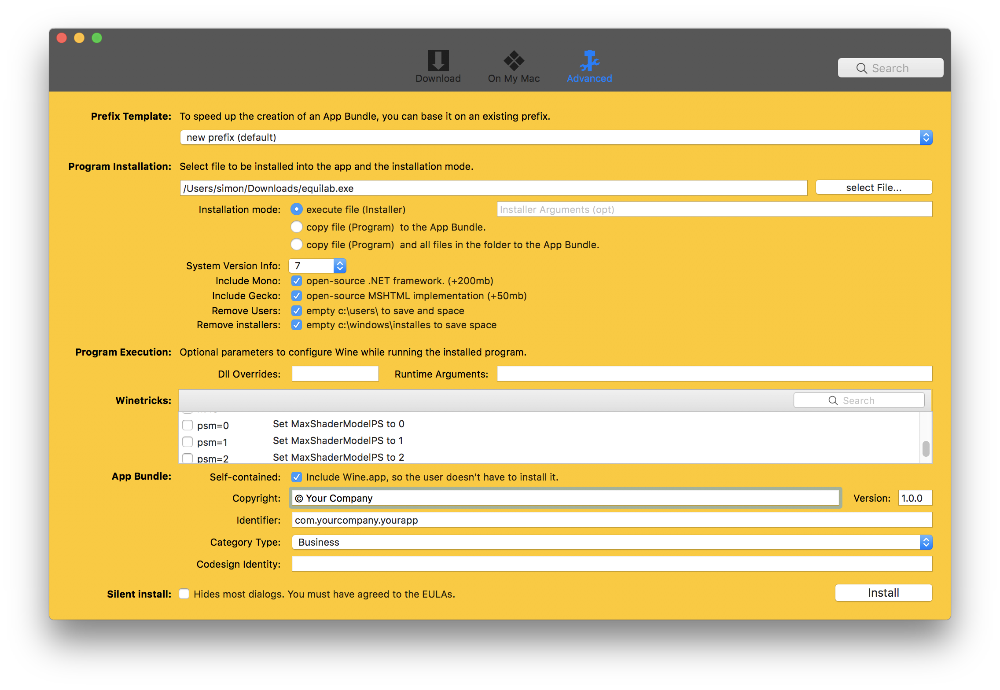
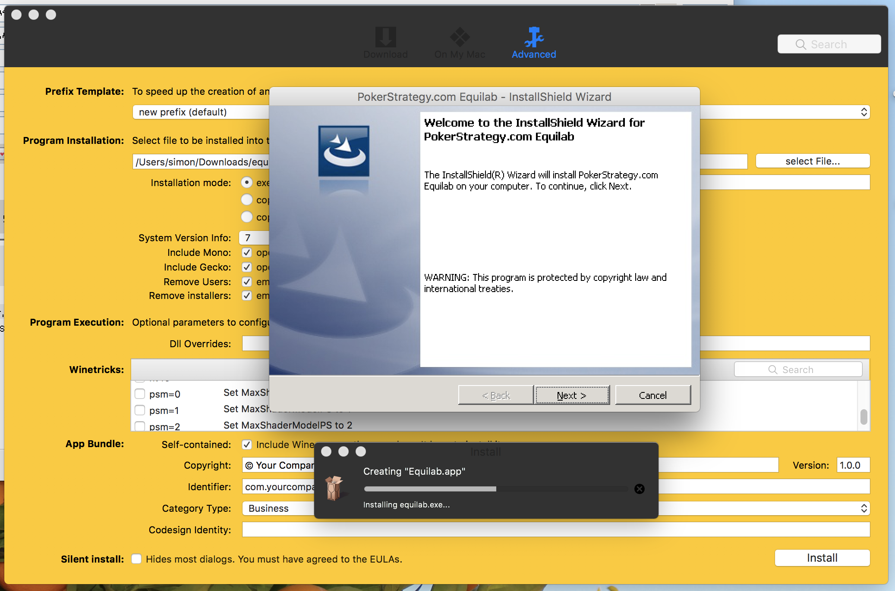
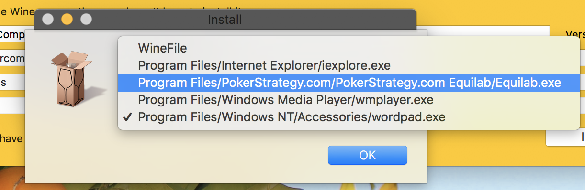
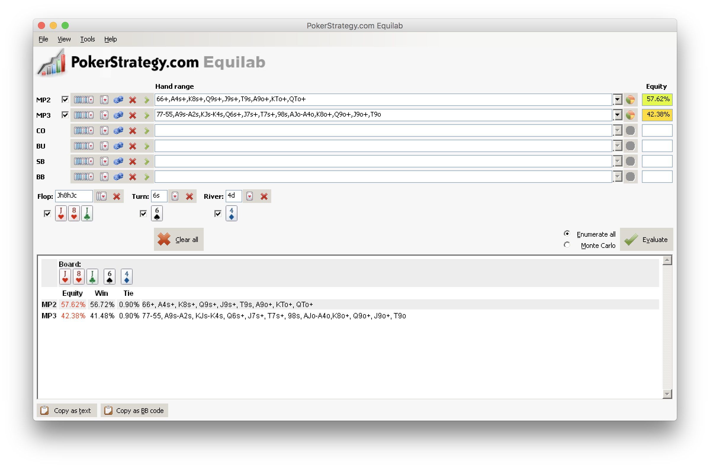

**Update 2022-02-04: Recently I took a look at the WineBottler website and found that it stopped supported newer MacOS versions. It is likely the reason why this method stops working. If you would like to keep using Equilab on your Mac, I would highly suggest you start moving your poker setup into a virtual Windows environment like Parallels or other Virtual Machine software. That’s how I use my daily Windows software on my Mac.**

I really liked to use Equilab as my poker learning tools. Back when I had a Windows computer, I would put in some of my hands from a session to do some range analysis. However, now with a Mac, there isn’t an equivalent tool on the platform that is as good as Equilab. So I decided to try out running Equilab directly on MacOS.

There is a tool named [WineBottler](http://winebottler.kronenberg.org/) and it is free to use. I downloaded both WineBottler and [Equilab Windows Installer](https://www.pokerstrategy.com/poker-software-tools/equilab-holdem/) from pokerstrategy’s website. When I opened WineBottler, I made the following configurations in the Advanced Tab:

Note that we don’t really need to include any winetricks, because Equilab is a simple Windows program. Once we hit install, a prompt shows up for us to choose a location for saving the App Bundle, then WineBottler will fire up the Windows installer within MacOS:

We just need to go through the installer like when we are in Windows to install, and when it is done, WineBottler will prompt us to choose the start file for the bundle, and here we just need to choose `equilab.exe`:

At the end The App bundle will be created, and when we open it, the Equilab interface shows up on our Mac!

Hope you find the guide useful, and if you have questions, feel free to comment down below and I will be happy to answer. If anyone would love to get a final bundled version by me, you can find it [here](https://drive.google.com/file/d/0BxVaAslT4zEtMzVoZkRlMHBjRGs/view?usp=sharing).