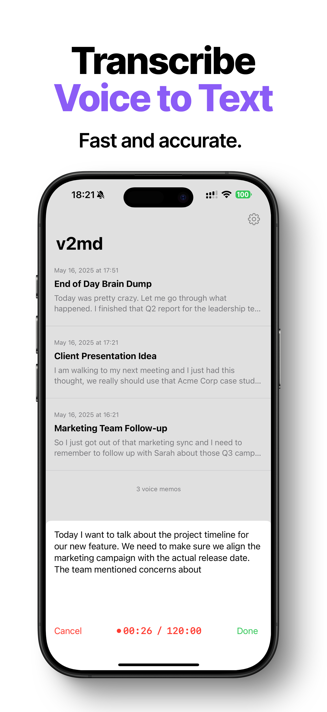
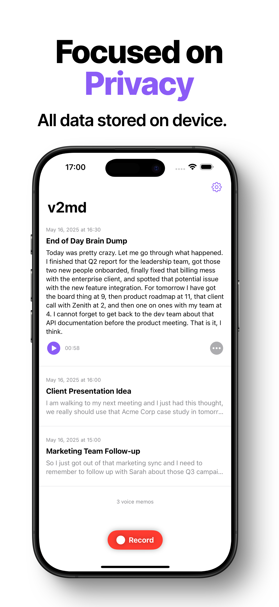
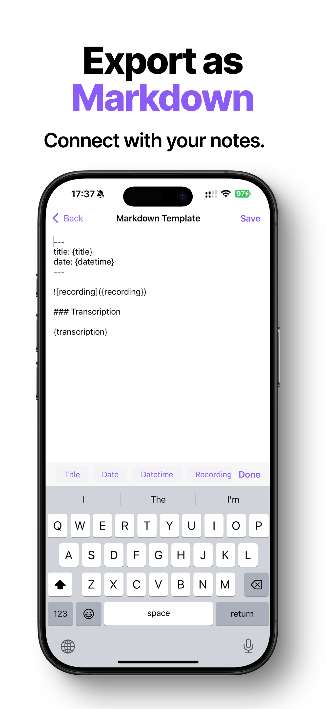

Sometimes I would like to record a quick thought or reminder with voice when I am on the go, but I found that it was not that easy to get the transcriptions accurately and save into Obsidian. As a developer, I have tried many things over the years, such as setting up a Shortcut or building an Obsidian plugin that works on mobile. But neither works well enough to me. Recently I picked up iOS development so I built this simple app to do exactly that.

v2md is [an app that transcribes audio to text](https://v2md.app/?ref=blog) using advanced AI models and saves both the recording and the transcription in Markdown locally. With this mechanism, you can push voice memos straight into your Obsidian vault.

What separates this app from others, is that I built it with privacy in mind. The app does not ask for a login, and all of the data is only stored within your device. Since I travel a lot and want to be able to quickly capture something when I am on the plane, I use Apple's Speech Recognition as a fallback so the app can partially function while offline.

I plan on making this app smarter and more connected with the notes in the vault. For example, Tana's Supertag feature is fascinating to me and I want to see if I can replicate that for Obsidian using v2md.

You can check it out [from the App Store](https://apps.apple.com/us/app/v2md-transcribe-audio-to-text/id6744820344) and any feedback is welcome! Please let me know if there are any issues or questions while using the app. Cheers!

